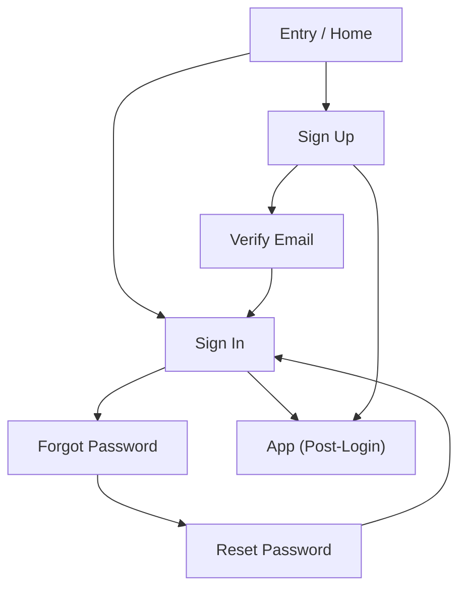

## 1. Product Overview
Custom authentication pages for your web app, supporting Google OAuth and email/password sign-in.
Includes email verification, password reset, responsive UI, and robust error handling.

## 2. Core Features

### 2.1 User Roles
| Role | Registration Method | Core Permissions |
|------|---------------------|------------------|
| Guest | Not registered / not signed in | Can access auth pages; can initiate sign-in/sign-up; can request password reset |
| Signed-in User | Google OAuth or email/password | Can access the app after authentication; can manage own session |

### 2.2 Feature Module
Our authentication requirements consist of the following main pages:
1. **Entry / Home**: auth CTA (sign in / sign up), session-aware redirect.
2. **Sign In**: Google sign-in, email/password sign-in, error + loading states.
3. **Sign Up**: Google sign-up, email/password sign-up, verification instructions.
4. **Verify Email**: confirmation success/failure messaging, resend verification.
5. **Forgot Password**: request reset email, success/failure messaging.
6. **Reset Password**: set new password from reset link, confirmation + errors.

### 2.3 Page Details
| Page Name | Module Name | Feature description |
|-----------|-------------|---------------------|
| Entry / Home | Auth entry | Display sign-in/sign-up primary actions; redirect signed-in users to the app landing page |
| Sign In | Provider sign-in | Start Google OAuth; handle popup/redirect completion; surface provider errors |
| Sign In | Email/password sign-in | Validate inputs; submit credentials; show inline field errors and global errors; disable submit while loading |
| Sign In | Session handling | Redirect after success; preserve intended destination via return URL |
| Sign Up | Provider sign-up | Start Google OAuth sign-up; handle completion; surface provider errors |
| Sign Up | Email/password sign-up | Validate password rules; create account; show “check your email” state when verification is required |
| Sign Up | Terms/consent (minimal) | Require acceptance checkbox only if legally necessary; block submit until checked |
| Verify Email | Verification status | Show verified success state; show expired/invalid link state with next-step guidance |
| Verify Email | Resend verification | Trigger resend; rate-limit messaging; show success/failure |
| Forgot Password | Reset request | Collect email; send reset email; show generic success message to prevent account enumeration |
| Forgot Password | Error handling | Show network/server errors; allow retry |
| Reset Password | Set new password | Validate new password + confirm; submit update; show success and link-to-sign-in |
| Reset Password | Invalid link handling | Detect missing/expired token; show “request a new reset email” CTA |
| All auth pages | Robust error UX | Map backend errors to friendly messages; keep technical details out of UI; provide retry paths |
| All auth pages | Responsive UI | Provide desktop-first layout that collapses cleanly to mobile; ensure accessible form controls |

## 3. Core Process
**Guest Flow (Email/Password Sign-Up + Verification)**
1. Open Entry/Home and choose Sign Up.
2. Enter email and password and submit.
3. App shows “Check your email to verify your account.”
4. User clicks verification link; Verify Email page confirms success.
5. User proceeds to Sign In (or auto-redirect if session is active).

**Guest Flow (Google Sign-In / Sign-Up)**
1. Open Sign In or Sign Up.
2. Click “Continue with Google.”
3. Complete Google consent; return to app.
4. App creates/uses session and redirects to the intended destination.

**Guest Flow (Password Reset)**
1. From Sign In, select “Forgot password?”.
2. Enter email; app sends reset email (always show a generic success).
3. User opens link to Reset Password page.
4. User sets new password; app confirms and links back to Sign In.

