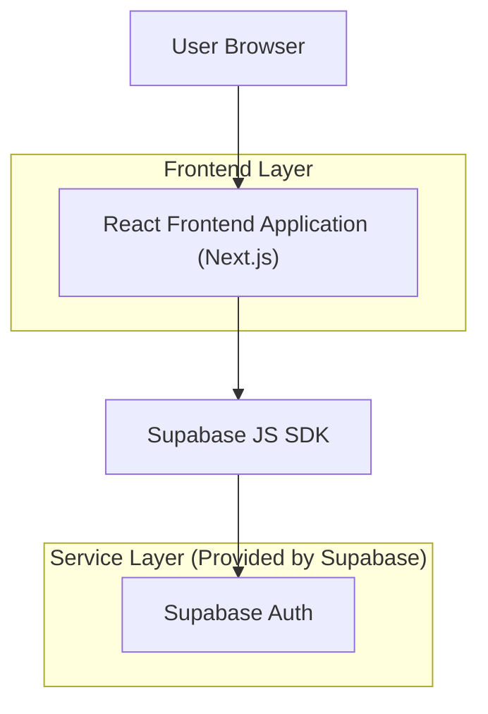

## 1.Architecture design

## 2.Technology Description
- Frontend: Next.js (React@18) + TypeScript + tailwindcss
- Backend: Supabase (Auth only)
- Shared/Auth SDK: @supabase/supabase-js

## 3.Route definitions
| Route | Purpose |
|-------|---------|
| / | Entry/home with sign-in and sign-up CTAs; session-aware redirect |
| /sign-in | Custom sign-in UI (Google + email/password) |
| /sign-up | Custom sign-up UI (Google + email/password) |
| /verify-email | Displays verification success/failure; optional resend flow |
| /forgot-password | Request password reset email |
| /reset-password | Set a new password from reset link |

## 4.API definitions (If it includes backend services)
None (frontend calls Supabase Auth directly).

## 6.Data model(if applicable)
Not required for authentication-only scope (users are managed by Supabase Auth).

### Error handling and UX rules (implementation-level guidance)
- Normalize auth errors into user-safe messages (e.g., invalid credentials, email not confirmed, provider cancelled, rate limited).
- Always show a generic success for password reset requests to avoid account enumeration.
- Use a global “auth error banner” plus field-level validation messages.
- Prevent double-submit with loading states and disabled buttons.
- Preserve return URL across sign-in/up to redirect users to their intended destination.
